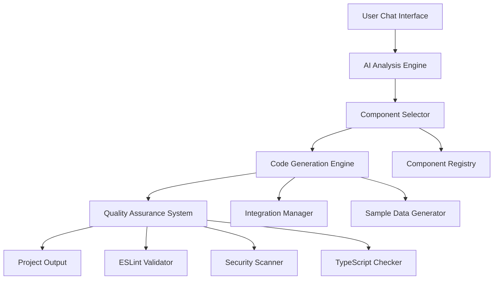

# System Architecture

## High-Level Architecture



## Core Components

### 1. Frontend Architecture (Next.js App)

#### Chat Interface Layer
```typescript
interface ChatMessage {
  id: string;
  role: 'user' | 'assistant' | 'system';
  content: string;
  timestamp: Date;
  attachments?: FileAttachment[];
}

interface GenerationState {
  status: 'idle' | 'analyzing' | 'selecting' | 'generating' | 'complete' | 'error';
  progress: number;
  currentStep: string;
  generatedFiles?: GeneratedFile[];
  previewUrl?: string;
}
```

#### Main Components
- **AppBuilderChat**: Main chat interface component
- **GenerationProgress**: Real-time progress indicator
- **PreviewPanel**: Live app preview iframe
- **CodeExplorer**: File tree and code viewer
- **FileExplorer**: Generated files browser

### 2. Backend Architecture (Node.js/Next.js API)

#### API Routes Structure
```
/api/
├── generate-app          # Main app generation endpoint
├── component-registry    # Component metadata and search
├── integrations         # Available integrations
├── preview/[id]         # Generated app preview
├── download/[id]        # Project download
└── validate             # Code quality validation
```

#### Core Services
- **RequirementAnalyzer**: Parses user input and extracts features
- **ComponentSelector**: AI-powered component selection
- **CodeGenerator**: Assembles components into complete apps
- **QualityAssuranceSystem**: Validates generated code
- **IntegrationManager**: Handles third-party service setup

### 3. Component Registry System

#### Component Metadata Structure
```typescript
interface ComponentMetadata {
  id: string;
  name: string;
  category: 'layout' | 'ui' | 'feature' | 'page';
  description: string;
  dependencies: string[];
  incompatibleWith: string[];
  requiredIntegrations: ('auth' | 'db' | 'payments')[];
  complexity: 'simple' | 'medium' | 'complex';
  variants: ComponentVariant[];
  eslintCompliant: boolean;
  testCoverage: number;
}

interface ComponentVariant {
  id: string;
  name: string;
  description: string;
  previewImage: string;
  code: {
    component: string;
    styles?: string;
    types?: string;
    tests?: string;
  };
  props: ComponentProp[];
}
```

#### Component Categories
- **UI Components**: Buttons, forms, modals, navigation
- **Layout Components**: Headers, footers, sidebars, grids
- **Feature Components**: Authentication, dashboards, data tables
- **Page Components**: Landing pages, dashboard layouts, forms

### 4. AI Component Selection System

#### Selection Algorithm
1. **Requirement Analysis**: Extract features and entities
2. **Component Filtering**: Filter by compatibility and requirements
3. **Optimization**: Select optimal variants based on context
4. **Validation**: Ensure component compatibility

#### Selection Criteria
- **Feature Matching**: Components that fulfill required functionality
- **Compatibility**: No conflicting dependencies
- **Quality Score**: Prefer higher-quality, well-tested components
- **User Preferences**: Style and complexity preferences

### 5. Code Generation Pipeline

#### Generation Phases
```typescript
class CodeGenerator {
  async generateProject(selection: ComponentSelection): Promise<GeneratedProject> {
    // 1. Generate all files
    const files = await this.generateAllFiles(selection);
    
    // 2. Run ESLint fixes
    const lintedFiles = await this.lintAndFixFiles(files);
    
    // 3. Run type checking
    const typeCheckedFiles = await this.runTypeChecking(lintedFiles);
    
    // 4. Generate package.json
    const packageJson = this.generatePackageJson(selection);
    
    // 5. Generate config files
    const configFiles = this.generateConfigFiles();
    
    return {
      files: typeCheckedFiles,
      packageJson,
      configFiles,
      setupInstructions: this.generateSetupInstructions(selection),
      qualityScore: await this.calculateQualityScore(typeCheckedFiles)
    };
  }
}
```

#### File Generation
- **Component Assembly**: Combine selected components
- **API Route Generation**: Create necessary API endpoints
- **Database Schema**: Generate Prisma schema
- **Configuration Files**: Next.js, Tailwind, ESLint configs
- **Sample Data**: Create realistic mock data

### 6. Quality Assurance System

#### Quality Checks
```typescript
interface QualityCheck {
  name: string;
  score: number;
  passed: boolean;
  details: any;
}

class QualityAssuranceSystem {
  async validateProject(project: GeneratedProject): Promise<QualityReport> {
    return {
      overall: this.calculateOverallScore([
        await this.runESLintChecks(project),
        await this.runTypeScriptChecks(project),
        await this.runSecurityChecks(project),
        await this.runPerformanceChecks(project),
        await this.runAccessibilityChecks(project)
      ])
    };
  }
}
```

#### Validation Pipeline
1. **ESLint Compliance**: Ensure code follows linting rules
2. **TypeScript Validation**: No type errors
3. **Security Audit**: Check for common vulnerabilities
4. **Performance Analysis**: Bundle size and optimization
5. **Accessibility Checks**: WCAG compliance

### 7. Integration Management System

#### Integration Templates
```typescript
interface IntegrationTemplate {
  id: string;
  name: string;
  dependencies: string[];
  envVars: Record<string, string>;
  files: Record<string, string>;
  setupInstructions: string;
}

const INTEGRATION_TEMPLATES = {
  stripe: { /* Stripe payment integration */ },
  clerk: { /* Clerk authentication */ },
  prisma: { /* Database setup */ },
  // ... more integrations
};
```

#### Integration Features
- **Automatic Setup**: Generate configuration files
- **Environment Variables**: Template .env files
- **Setup Documentation**: Step-by-step guides
- **Validation**: Test integration endpoints

### 8. Sample Data Generation

#### Data Generation Strategy
```typescript
class SampleDataGenerator {
  generateForProject(analysis: RequirementAnalysis): SampleDataPackage {
    const entities = this.extractEntities(analysis);
    
    return {
      data: this.generateEntityData(entities),
      queryHooks: this.generateQueryHooks(entities),
      apiRoutes: this.generateAPIRoutes(entities),
      queryClient: this.generateQueryClient()
    };
  }
}
```

#### Generated Assets
- **Mock Data**: Realistic sample data for entities
- **API Routes**: Working endpoints with CRUD operations
- **React Query Hooks**: Data fetching hooks
- **Type Definitions**: TypeScript interfaces

## Data Flow

### 1. User Input Processing
```
User Message → RequirementAnalyzer → ExtractedFeatures
```

### 2. Component Selection
```
ExtractedFeatures → ComponentSelector → SelectedComponents
```

### 3. Code Generation
```
SelectedComponents → CodeGenerator → GeneratedFiles
```

### 4. Quality Assurance
```
GeneratedFiles → QualityAssuranceSystem → ValidatedProject
```

### 5. Output Delivery
```
ValidatedProject → ProjectPackager → DownloadableApp
```

## Scalability Considerations

### Performance Optimization
- **Component Caching**: Cache frequently used components
- **Generation Parallelization**: Run quality checks in parallel
- **CDN Integration**: Serve static assets from CDN
- **Database Optimization**: Efficient component queries

### Extensibility
- **Plugin Architecture**: Support for third-party extensions
- **Component Contributions**: Community component library
- **Multi-Stack Support**: Framework-agnostic architecture
- **API Versioning**: Backward-compatible API changes

### Reliability
- **Error Handling**: Graceful failure modes
- **Rollback Capability**: Revert to working versions
- **Health Monitoring**: System performance tracking
- **Backup Systems**: Component and project backups
